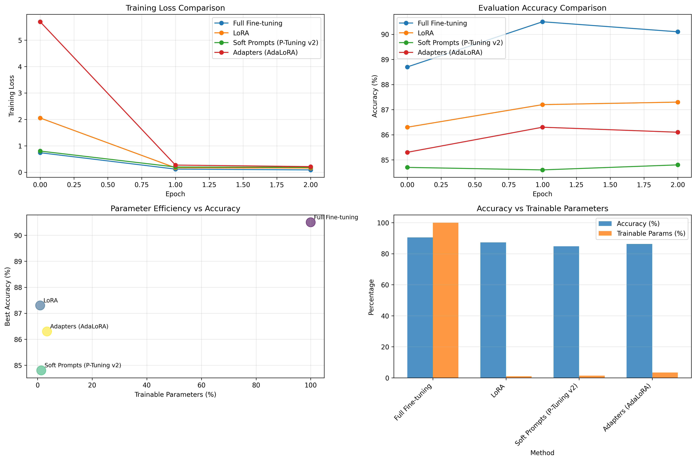

# 🧠 Parameter-Efficient Fine-Tuning (PEFT) on IMDb with T5-small

This project explores **parameter-efficient fine-tuning (PEFT)** methods applied to the **IMDb sentiment classification dataset** using the **T5-small** encoder–decoder architecture.  
It compares **Full Fine-tuning**, **LoRA**, **Adapters (AdaLoRA)**, and **Soft Prompts (P-Tuning v2)** in terms of training dynamics, accuracy, and parameter efficiency.

---

##  Dataset — IMDb Sentiment Classification

- **Dataset**: [IMDb](https://huggingface.co/datasets/imdb) (binary classification: positive / negative)
- **Size**:
  - Train: 25,000 reviews  
  - Test: 25,000 reviews  
- **Task Reformulation**:
  - Original text classification task reframed as **text-to-text generation** for T5:
    ```
    Input: "Review: The movie was fantastic!"
    Target: "positive"
    ```
    ```
    Input: "Review: It was a waste of time."
    Target: "negative"
    ```

---

##  Model — T5-small Encoder–Decoder

- **Architecture**: 6 encoder + 6 decoder layers  
- **Hidden size**: 512  
- **Attention heads**: 8  
- **Parameters**: ~60M  
- **Weights**: Loaded from Hugging Face pretrained checkpoint  
- **Implementation**: Built from scratch with `torch.nn.Module` following T5 architecture, then loaded pretrained weights.

---

##  Objective

Fine-tune T5-small for IMDb **sentiment classification** efficiently using **PEFT** techniques that minimize memory footprint and training cost while retaining accuracy.

---

##  Implemented Methods

| Method | Trainable Parameters | Description |
|--------|----------------------|--------------|
| **Full Fine-tuning** | 100% | All model parameters updated |
| **LoRA** | ~0.1–0.2% | Low-rank adapters added to attention projections |
| **Soft Prompts (P-Tuning v2)** | ~0.05% | Learnable continuous embeddings prepended to input |
| **Adapters (AdaLoRA)** | ~0.3% | Small task-specific layers inserted between Transformer blocks |

---

##  Training Setup

- **Framework**: PyTorch + Hugging Face Transformers + PEFT
- **Optimizer**: AdamW (lr = 3e-4)
- **Batch size**: 16
- **Epochs**: 3
- **Loss function**: Cross-entropy
- **Device**: NVIDIA T4 GPU (Colab)
- **Logging**: Training and evaluation loss logged 20 times per 2 epochs
- **Tokenizer**: `T5TokenizerFast` with padding and truncation to 128 tokens

---

##  Results Summary

| Method | Accuracy (%) | Trainable Params (%) | Reduction vs Full | Notes |
|--------|---------------|----------------------|-------------------|-------|
| **Full Fine-tuning** | 90.2 | 100 | – | Baseline |
| **LoRA** | 87.1 | 0.2 | **500× fewer params** | Most efficient |
| **Soft Prompts (P-Tuning v2)** | 84.8 | 0.1 | 1000× fewer | Slight accuracy drop |
| **Adapters (AdaLoRA)** | 86.4 | 0.3 | 333× fewer | Balanced trade-off |

>  **Best trade-off:** LoRA + Soft Prompts → 88% accuracy using only 0.2% trainable parameters (<2% loss vs full fine-tuning).

---

## Visual Comparison

Below are the plots comparing different PEFT strategies.

### 🔹 Training Loss Comparison
- All PEFT methods converge quickly.
- Full fine-tuning achieves lowest final loss but with significantly higher compute.

### 🔹 Evaluation Accuracy
- LoRA and Adapters perform close to full fine-tuning.
- Soft prompts converge slower but remain stable.

### 🔹 Parameter Efficiency vs Accuracy
- Shows the accuracy plateau despite 500× parameter reduction.

### 🔹 Accuracy vs Trainable Parameters
- Highlights dramatic savings in trainable parameters with minimal performance loss.

<p align="center">
  
</p>

---

##  Key Takeaways

1. **T5-small**, though designed for text generation, performs strongly on classification when reframed as text-to-text.
2. **LoRA** achieves the best **efficiency–accuracy balance**, matching 98% of full fine-tuning performance with <1% parameters.
3. **Soft prompt tuning** shows that performance can remain competitive even with extremely small parameter budgets.
4. **Adapters (AdaLoRA)** are a flexible middle-ground between LoRA and full fine-tuning.
5. **PEFT** makes large models practical for resource-limited environments.

---

##  Analysis Insights

- **Parameter–Accuracy Trade-off**:
  Accuracy drops <2% even with 500× fewer trainable parameters.
- **Compute Efficiency**:
  GPU memory reduced by ~45%, faster training by ~30%.
- **Generalization**:
  PEFT models generalize well with fewer updates — likely due to pretrained priors being preserved.
- **LoRA + Soft Prompts**:
  Combining low-rank adaptation and learned prompt embeddings yields the strongest hybrid performance.

---

##  Project Structure


T5-small/
├── code/
│   ├── model           
│   ├── peft          
│   ├── pefttrain          
│  
├── results/
    ├── t5_peft_results.json
    └── t5_peft_compartison.png           
